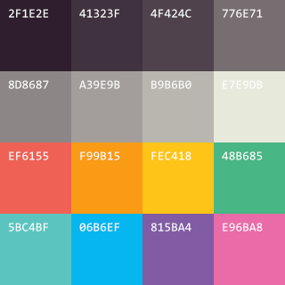
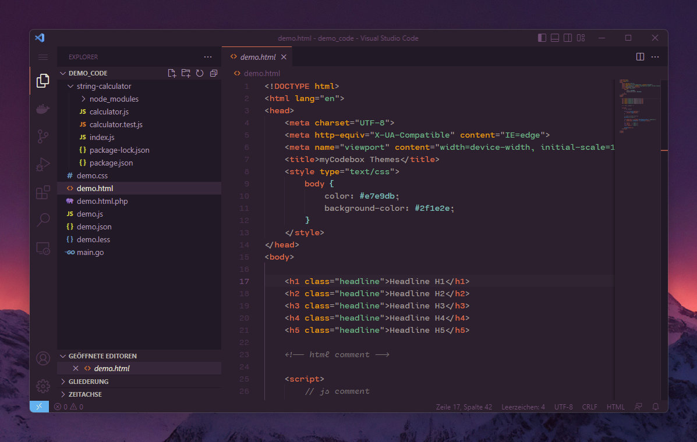
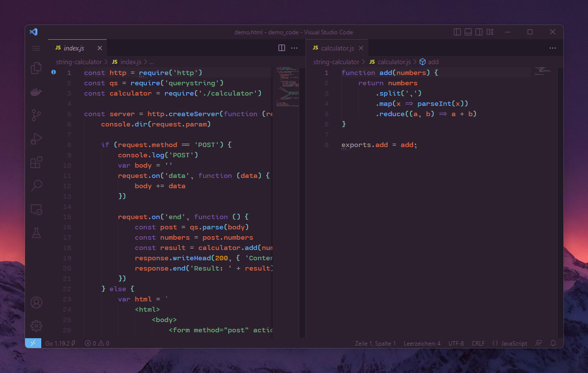
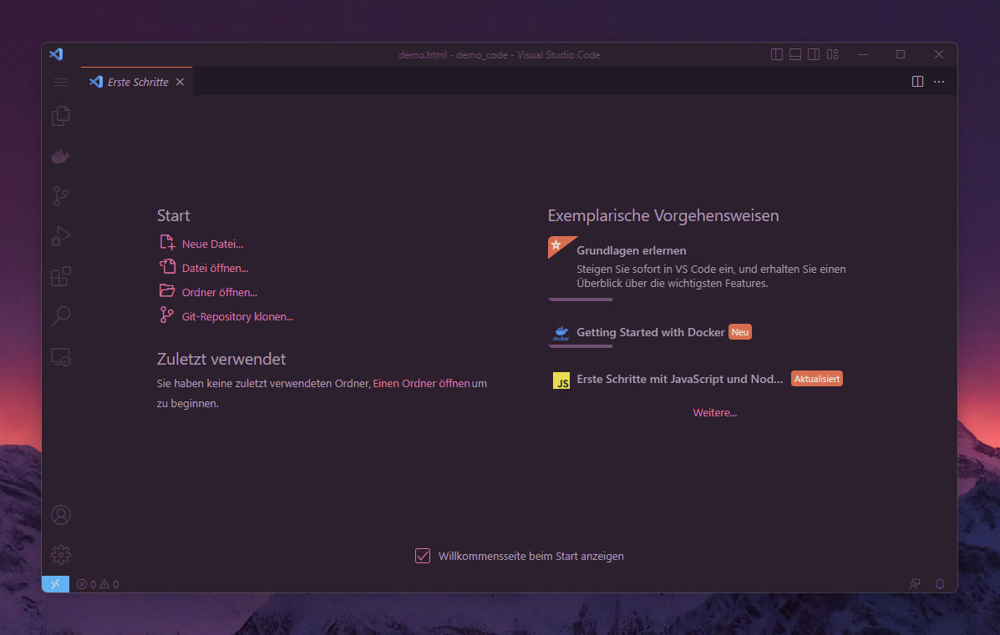
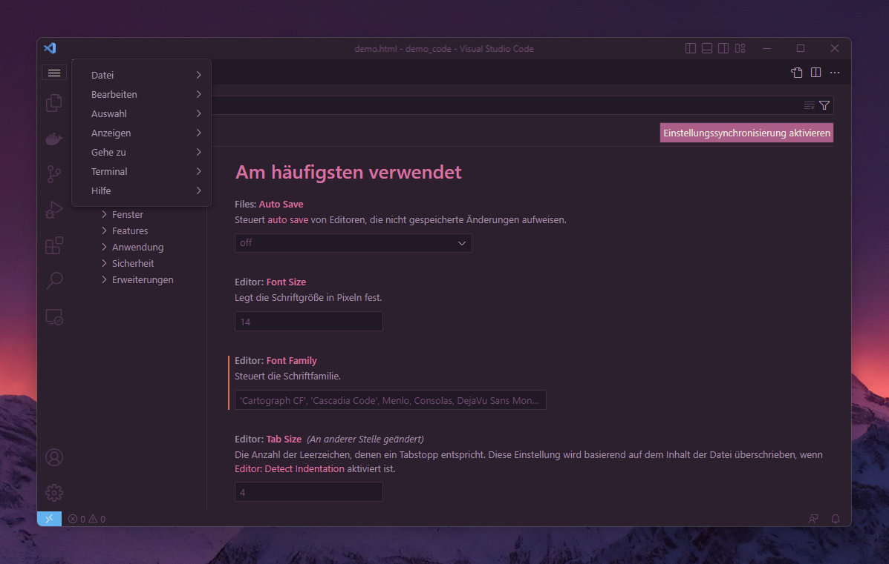
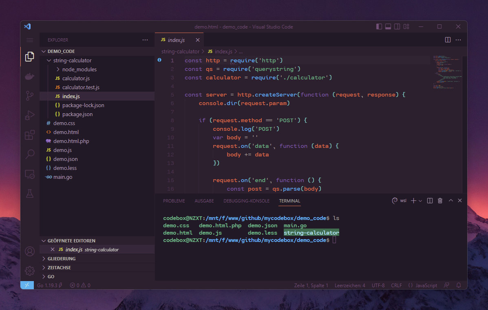

# myCodebox-themes README

Since the ATOM.io project is discontinued and there is no suitable VS code theme (I love Paríso), I decided to create my own theme.

I would like to thank [idleberg](https://github.com/idleberg/atom-paraiso-dark) for his Atom theme implementation and of course also [Rubens LP](https://www.rubenslp.com.br/) for its beautiful colors. 👋


## The colors 🌈



```
base00: "2f1e2e" # ----
base01: "41323f" # ---
base02: "4f424c" # --
base03: "776e71" # -
base04: "8d8687" # +
base05: "a39e9b" # ++
base06: "b9b6b0" # +++
base07: "e7e9db" # ++++
base08: "ef6155" # red
base09: "f99b15" # orange
base0A: "fec418" # yellow
base0B: "48b685" # green
base0C: "5bc4bf" # aqua
base0D: "06b6ef" # blue
base0E: "815ba4" # purple
base0F: "e96ba8" # brown
```


## The screens 🖼️








## The info ⭐

* [idleberg](https://github.com/idleberg/atom-paraiso-dark)
* [Rubens LP](https://www.rubenslp.com.br/)
* [VS Code Theme Color References](https://code.visualstudio.com/api/references/theme-color)

**Enjoy and Happy Coding!**
